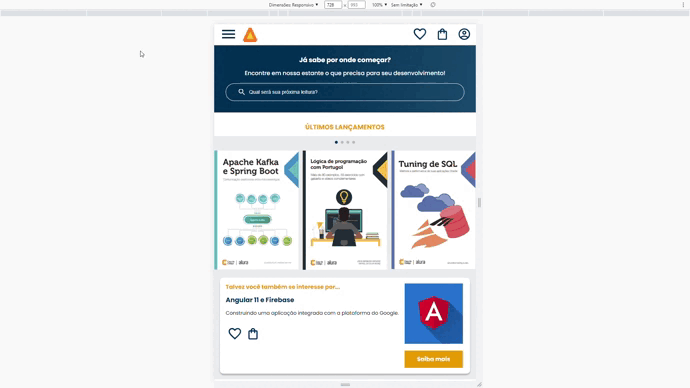
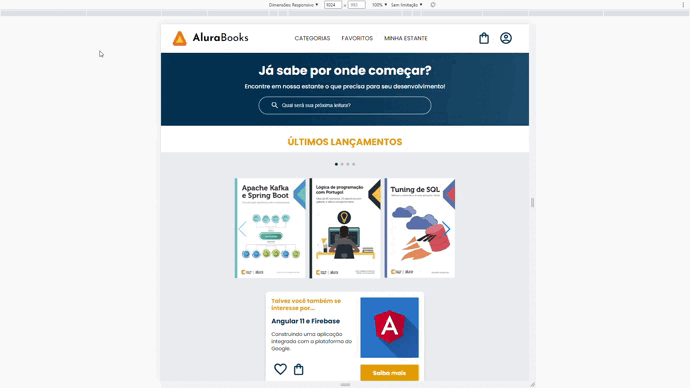
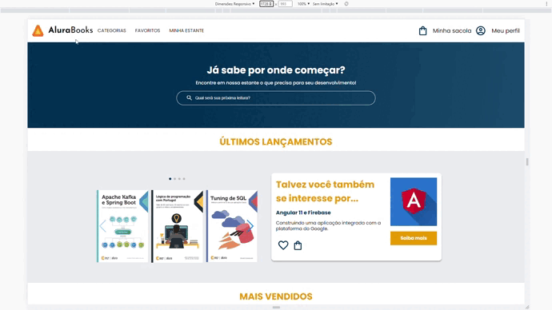

# **Alura Book**

## 📝 **Descrição**

Projeto desenvolvido no curso de formação em HTML e CSS da [Alura](https://www.alura.com.br/), cujo objetivo era desenvolver o site de livros Alura Book, para exercitar responsividade em diferentes plataformas, para tal a página foi desenvolvida para atender a três tamanhos de telas diferentes (mobile, tablet e desktop).

   Telas Mobile

   Telas Tablet

   Telas Desktop

## 📂 **Acesso ao projeto**

Através desses links você terá acesso a [página web](https://danoliveiradev.github.io/alura-book/) e aos [arquivos do projeto](https://github.com/danoliveiradev/alura-book).

## 🛠 **Técnicas, tecnologias e bibliotecas utilizadas**

`HTML5`
`CSS3`
[`SwiperJS`](https://swiperjs.com/)

## 👥 **Contribuição**

[`Pedro Marins`](https://www.linkedin.com/in/pedromarins/)
[`Matheus Alberto`](https://www.linkedin.com/in/matheus-alberto-marcus/)
[`Mônica Mazzochi Hillman`](https://www.linkedin.com/in/monicamhillman/)
[`Vanessa Me Tonini`](https://www.linkedin.com/in/vanessametonini/)
[`Juliana Amoasei`](https://www.linkedin.com/in/juliana-amoasei/)
  
## 🤓 **Desenvolvedores**

| [ Daniel Oliveira](https://github.com/danoliveiradev) |
| :---: |

## 🔐 **Licença**

Este projeto está licenciado nos termos da [licença MIT](LICENSE).
